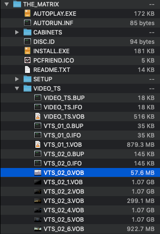
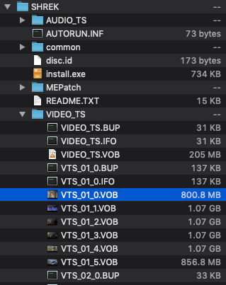
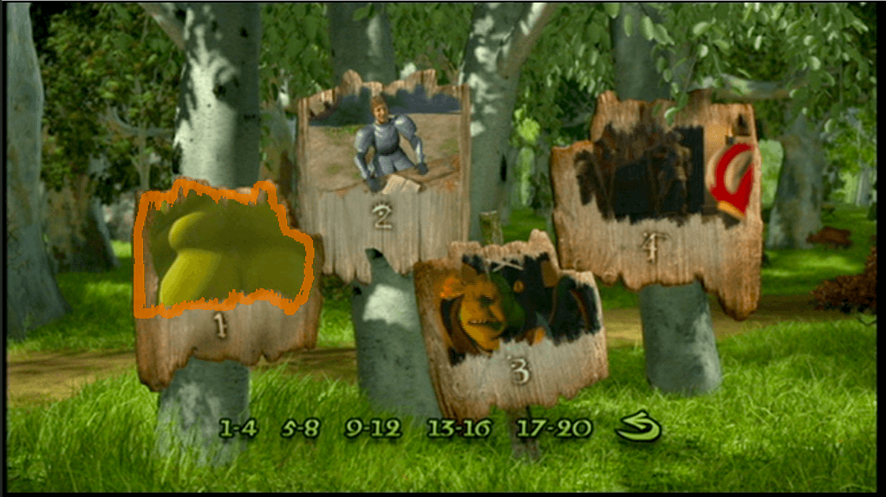
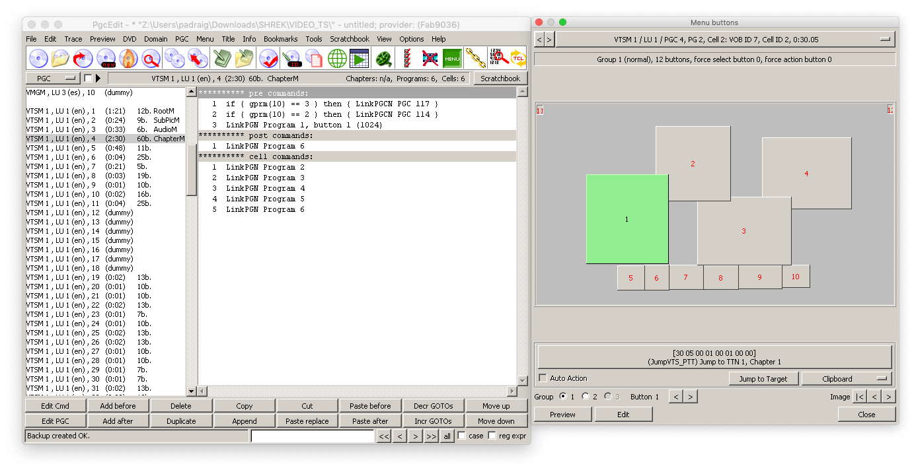

# DVD Menu Replica Thing

No, I don't know why I made this...

Previewable at https://dvd-rom.netlify.app/

### How this project copies that

- Have a video player running a file in the background
- Has a JSON file which outlines all of the actions within the menu and positioning of various links and buttons
- Capable of including local storage updates for attributes such as subtitles and audio track

### What doesn't work?

Absolutely loads, please see the TODO file

### How to run

```
yarn install
yarn start
```

## But why???

A few months ago I abruptly got super interested in director commentary tracks as work accompaniment audio (the first few Simpsons ones are fantastic, the Criterion ones with academics are 👌) and was on a big DVD nostalgia kick trying to get my hands on some neat sounding ones that were hard to find.

Around the same time I had been messing about with videojs for [another side project](https://react-coursebuilder.netlify.app). So one day I was like...

> ...I wonder how DVD menus work?[[*](#how)]
> 
> ...were they just loads of videos?[[*](#how-video)]
> 
> ...and how were the buttons styled?[[*](#how-buttons)]
> 
> ...or how were transitions handled?[[*](#how-flow)]
> 
> ...but also, how did those ones with multiple tiny videos playing in a menu work? What about the static menus with audio in the background?[[*](#how-media-variants)]
> 
> And what was the deal with those specific versions of the main menu with an intro that would only play once?[[*](#how-intro)]

The way I saw it, I had two options to answer all these questions:

1.  Read an article on how DVDs work
2.  Figure it out myself, give myself some sort of excuse to rip a DVD and start poking around its insides

So yeah... I went with #2.

### Objectives

*   make an SPA from a very well known film from the peak of the DVD era
*   Host the videos on youtube if at all possible so it could _potentially_ be easily adapted by other people without much need to mess with the JavaScript
*   Most if not all data within the app for a DVD to be contained within one json file (e.g. [Shrek's here](https://github.com/padraigfl/dvd-menu/blob/master/src/shrek.json))
*   Routing, valid urls, the ability to go back and forward, have transitions between pages but not when going back

With the "well known" requirement I decided to go with the Matrix (features packed but came out before DVDs really took off) and Shrek (pretty much around the peak of elaborate menus)


_Had to buy the DVDs..._

### "I wonder how DVD menus work"

#### "Were they just loads of videos"

Not exactly? If you've ever dealt with the files of a DVD there's a VIDEO_TS folder with a whole load fo files following a format of VTS_[_x_]__y_.(VOB|BUP|IFO). The value of _x_ seems to be the same for all files relating to the menus and the main film file, with other x values typically relating to other bonus features, opening splash screens, trailers, etc.



_file structures for The Matrix and Shrek with the menu files highlighted_

Now, I know nothing about .VOB, all I know is ffmpeg occasionally cut the files when I converted to MP4 at points that suggest its a container with multiple individual video files within it.

#### "How were the buttons styled?"

Inactive buttons are hardcoded into the video.

As for active ones... *sigh* This was hard, I was able to get some info from the .BUP and .IFO files via a tool called [PGCEdit](http://download.videohelp.com/r0lZ/pgcedit/) that was strongly recommended on various threads from 2003\. Unfortuantely it's a Windows tool and I'm working on a Mac, and it hasn't been maintained since about 2010 and I'm in 2020\. Some users seemed to be able to apply modifications to button shapes and whatnot but I wasn't able to find that at all.

As seen in the pictures below, the coordinates and layouts of buttons on menus are quite simply specified, so I decided I may as well just do this manually with x, y, w and h coordinates. As most DVDs seemed to use a limited range of styles for highlighting active buttons (not Shrek though...), I just ripped them via screenshots ([example of highlighted field](static/why/shrekButtonHighlight.png))


_Shrek scene selection screen_


_PGCEdit represenation of scene selection screen's data_

If you wanna investigate further into what PGCEdit is at, [here](static/why/pgcLonger.png)'s a more advanced screenshot delving into one button.

#### "How were transitions handled?"

What I was able to find from PGCEdit was how the DVDs sequenced stuff, and it's altogether pretty damn simple

Basically the Menu is split up into loads of parts, each one can contain

*   Start point
*   End point
*   Action on end (e.g. redirect)
*   (optional) Buttons, which have their own definitions for actions (redirect, update subtitles/audio)

With this in mind I mapped out each screen to have a start and end point wired through to the video on page load and the ability to also accept toggle values that (I guess) could be relayed into the video too

Many DVDs have two versions of the root menu, one which only loaded the first time and another which occurs everywhere you access the shot from. It seems largely to be about handling whatever cute initial transition clip they play on inserting the DVD.

#### "How did those ones with multiple tiny videos playing in a menu work? What about the static menus with audio in the background?

They were all video files, if a film has silent menus it suggests they were so short on space that the menu is taking up as little space as it possible can (the Matrix relies on this heavily due to it being stuffed with video features), if a film has audio in a menu thats static that probably suggests that there's very little in the way of extra content on the disc cos they clearly aren't arsed about it

#### "what was the deal with those specific versions of the main menu with an intro that would only play once?"

Both Shrek and the Matrix's menu video files (links [here](https://youtu.be/V3airyA0Kig) and [here](https://youtu.be/ix0tlRLbTVw) have an initial transition, then a ~30 second video clip, which then is followed up by another one for the exact same menu). These are just loading different sections of the video on intitial play and providing no means to access that one again within the menus.

### ...and, er, did I learn anything from it?

Hmm...

@reach/router has been deprecated? @reach/router is very hard to google for?

Weird limitations like "it must be able to use videos from youtube" are a total waste of time in terms of learning unless there's a very practical reason for why.

It's not a good idea to make assumptions that require convoluted abstractions on the basis of an extremely small sample size (I assumed scene selection followed a very consistent format across pages due to how Shrek reused pieces, the Matrix did not do this so it's broken

iOS and autoplaying video is painful: I totally bailed on youtube for iOS devices and self hosted at super low res,

Oh, and it's quite easy to see how so many DVDs wound up coming out on two discs when you consider just how much fancy menus eat into the disc space but also became necessary for any film that didn't want to give off vibes of being cheap as all hell

Dumb bonus touches are the best part, so when doing a goofy project like this it's best to stick to a basic MVP and avoid headaches in the name of "extensibility", instead adding nonsense like the screensaver and remote control afterwards

